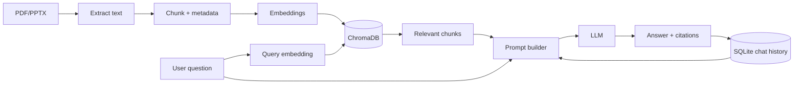

# NoteWise

NoteWise là hệ thống học tập cá nhân hóa từ tài liệu bài giảng cho môn **AI Product Development End-to-End**. Người học tải lên tài liệu PDF/PPTX, đặt câu hỏi theo ngữ cảnh môn học và nhận câu trả lời có căn cứ từ chính tài liệu đã nạp.

## 1. Kiến trúc hệ thống

```text
┌──────────────────────────┐      HTTP/JSON       ┌──────────────────────────┐
│ Frontend                  │  ◄────────────────►  │ Backend                  │
│ React + TypeScript        │                     │ FastAPI                  │
│ Vite + Tailwind CSS       │                     │ RAG orchestration        │
└──────────────────────────┘                     └─────────────┬────────────┘
                                                               │
                                  ┌────────────────────────────┼─────────────────────┐
                                  │                            │                     │
                         ┌────────▼────────┐         ┌─────────▼────────┐  ┌────────▼────────┐
                         │ ChromaDB        │         │ SQLite            │  │ LLM/Embeddings  │
                         │ vectors + meta  │         │ users + chats     │  │ OpenAI           │
                         └─────────────────┘         └──────────────────┘  └─────────────────┘
```

### Thành phần chính

- `frontend/`: giao diện React/TypeScript, build bằng Vite, style bằng Tailwind CSS.
- `backend/app/api/`: REST endpoints cho upload tài liệu, chat và danh sách tài liệu.
- `backend/app/services/`: nghiệp vụ ingest, chunking, retrieval và answer generation.
- `backend/app/models/`: SQLAlchemy engine/session và các model dữ liệu người dùng, tài liệu, lịch sử chat.
- `data/chroma/`: persistent vector store cục bộ, được tạo khi ứng dụng ingest dữ liệu.
- `data/notewise.db`: SQLite database cho metadata và chat history.

## 2. RAG pipeline

### Ingestion flow

1. Frontend gửi file PDF/PPTX đến backend qua multipart upload.
2. Backend kiểm tra extension, lưu file tạm và dùng `pypdf` hoặc `python-pptx` để trích xuất text.
3. Text được chuẩn hóa rồi chia thành các chunk có overlap bằng `RecursiveCharacterTextSplitter`.
4. Mỗi chunk được embed bằng embedding model và ghi vào ChromaDB cùng metadata: `document_id`, tên file, trang hoặc slide.
5. Thông tin file, chủ sở hữu và trạng thái ingest được lưu vào SQLite.

### Question answering flow

1. Người học gửi câu hỏi kèm `conversation_id`.
2. Backend lấy lịch sử hội thoại gần nhất để giữ ngữ cảnh, sau đó embed câu hỏi.
3. ChromaDB thực hiện similarity search và trả về các chunk liên quan nhất.
4. Prompt được tạo từ câu hỏi, lịch sử chat và context đã truy xuất.
5. LLM sinh câu trả lời; backend trả về answer cùng citations đến tài liệu/trang/slide.
6. Câu hỏi và câu trả lời được ghi vào SQLite để hiển thị lại ở các phiên sau.



## 3. Cấu trúc thư mục

```text
NoteWise/
├── backend/
│   ├── app/
│   │   ├── api/          # API routes
│   │   ├── models/       # Database session và ORM models
│   │   ├── services/     # Document ingestion và RAG
│   │   ├── config.py
│   │   └── main.py
│   └── README.md
├── frontend/
│   ├── src/
│   ├── index.html
│   ├── package.json
│   ├── tailwind.config.js
│   └── vite.config.ts
├── .env.example
├── .gitignore
├── package.json
├── requirements.txt
└── README.md
```

## 4. Cài đặt và chạy local

### Backend

```bash
python -m venv .venv
# Windows PowerShell
.\.venv\Scripts\Activate.ps1
pip install -r requirements.txt
copy .env.example .env
uvicorn backend.app.main:app --reload --port 8000
```

API docs có tại `http://localhost:8000/docs`; health check tại `http://localhost:8000/api/health`.

### Frontend

```bash
cd frontend
npm install
npm run dev
```

Frontend mặc định chạy tại `http://localhost:5173`.

## 5. Biến môi trường

Sao chép `.env.example` thành `.env`, sau đó điền `OPENAI_API_KEY`. Có thể thay LLM/embedding provider sau này bằng cách thay implementation trong `backend/app/services/` mà không đổi giao diện frontend.

## 6. Hướng phát triển tiếp theo

- Hoàn thiện upload và progress state cho ingest.
- Thêm xác thực người dùng và phân quyền theo tài liệu.
- Bổ sung citation UI, streaming answer và feedback để cá nhân hóa retrieval.
- Viết test cho parser PDF/PPTX, retrieval quality và API contract.
